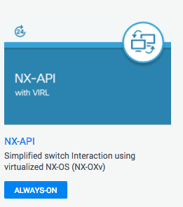

# techwisedemo\_network\_ansible
Playbooks and information used on TechWise TV Demo

Here is the code used in the Feb 2, 2017 TechWise TV Webinar Ansible Demonstration.  You can replicate the demo at anytime using the DevNet NX-API Sandbox.  

## Setup 

* Connect to the DevNet Sandbox: [NX-API with Virl](https://devnetsandbox.cisco.com/RM/Topology?c=14ec7ccf-2988-474e-a135-1e90b9bc6caf)
    * You will need to login
    * Follow connection instructions to connect over VPN

    
    
* Git the code 

    ```bash
    git clone https://github.com/hpreston/techwisedemo_network_ansible
    cd techwisedemo_network_ansible
    ```

* Install Ansible in Virtual Environment 

    ```bash
    virtualenv venv 
    source venv/bin/activate 
    pip install -r requirements.txt 
    ```

* **"Source"** the needed environment variables

    ```bash
    source .ansible_env
    ```

## Demos

### Infrastructure as Code Setup

* The `hosts` file provides the list of switches in the environment, including a breakdown by type.  

    ```
    [switches]
    172.16.1.90
    172.16.1.91
    172.16.1.92
    172.16.1.93
    
    [distribution]
    172.16.1.90
    172.16.1.91
    
    [access]
    172.16.1.92
    172.16.1.93    
    ```

    * Host specific configuration/variables stored in `host_vars/< IP ADDRESS >.yml`

        ```yaml
        svi_octet: 2
        ```

* Network Configuration Details stored in `group_vars/all.yml`.  This includes all VLANs to be maintained, HSRP and OSPF details.  

    ```yaml
    vlans:
      - vlan_id: 3001
        name: TechWise_01
        interface: Vlan3001
        prefix: 10.30.01.
        gw_mask: 24
        gw_addr: 10.30.01.1
      - vlan_id: 3002
        name: TechWise_02
        interface: Vlan3002
        prefix: 10.30.02.
        gw_mask: 24
        gw_addr: 10.30.02.1
    
    ospf:
      process: 30
      area: 30
    
    hsrp:
      group: 10    
    ```

### Demo 1: VLAN Management

* Run the `config_vlans.yml` playbook to deploy (ensure) the needed vlans 

    ```bash
    ansible-playbook config_vlans.yml
    ```

### Demo 2: Interface Management

* Run the `config_svis.yml` playbook to deploy (ensure) the SVIs are configured for the VLANs on the distribution switches

    ```bash
    ansible-playbook config_svis.yml
    ```

### Demo 3: IGP Configuration

* Run the `config_ospf.yml` playbook to deploy (ensure) OSPF is configured for the SVIs on the distribution switches

    ```bash
    ansible-playbook config_ospf.yml
    ```

### Demo 4: Putting it all together 

* Open up `group_vars/all.yml` and add a new VLAN 

    ```yaml
    vlans:
      - vlan_id: 3001
        name: TechWise_01
        interface: Vlan3001
        prefix: 10.30.01.
        gw_mask: 24
        gw_addr: 10.30.01.1
      - vlan_id: 3002
        name: TechWise_02
        interface: Vlan3002
        prefix: 10.30.02.
        gw_mask: 24
        gw_addr: 10.30.02.1
      - vlan_id: 3010
        name: TechWise_10
        interface: Vlan3010
        prefix: 10.30.10.
        gw_mask: 24
        gw_addr: 10.30.10.1
    ```

* Run the `site_config.yml` playbook to update the network for this new VLAN AND ensure other VLANs are correctly configured 
    * It Adds the VLAN to all Switches 
    * Configures the SVIs on the Distirbution Switches 
    * Enables Routing 

    ```bash
    ansible-playbook site_config.yml
    ```

### Rolling Back the Demos 

Playbooks are included to undo all the changes

* Playbook `remove_ospf.yml` will remove the SVIs VLANs from the distribution switches
* Playbook `remove_svis.yml` will remove the SVIs VLANs from the distribution switches
* Playbook `remove_vlans.yml` will remove the VLANs from the switches
* Playbook `site_reset.yml` will completely remove all configuration changes
